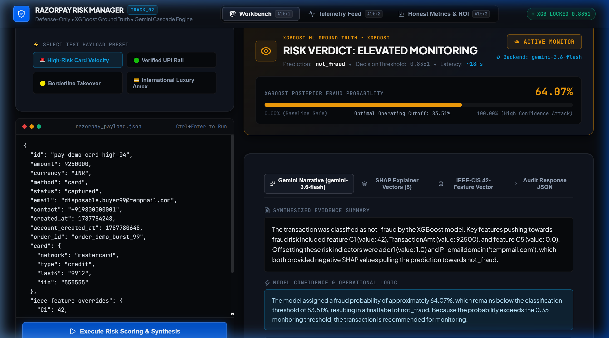
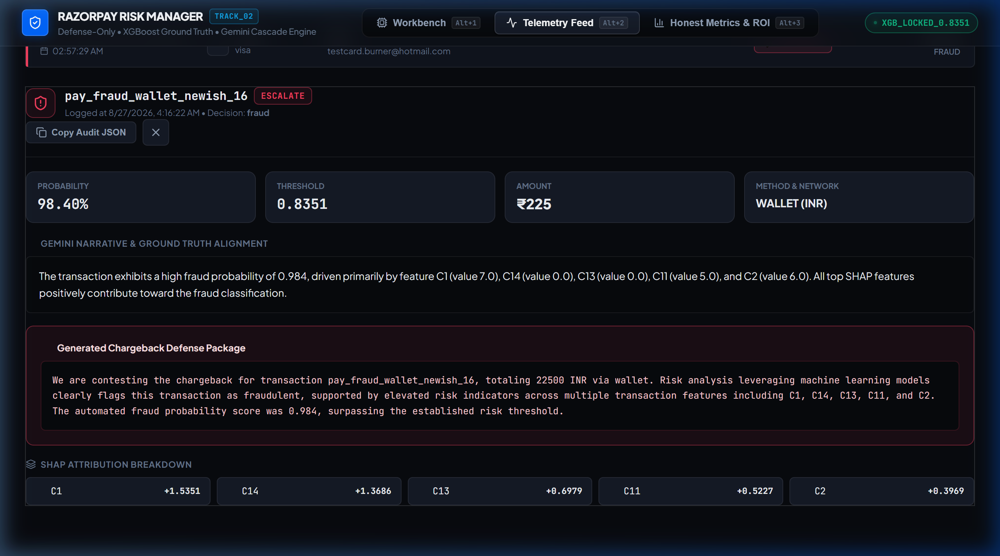
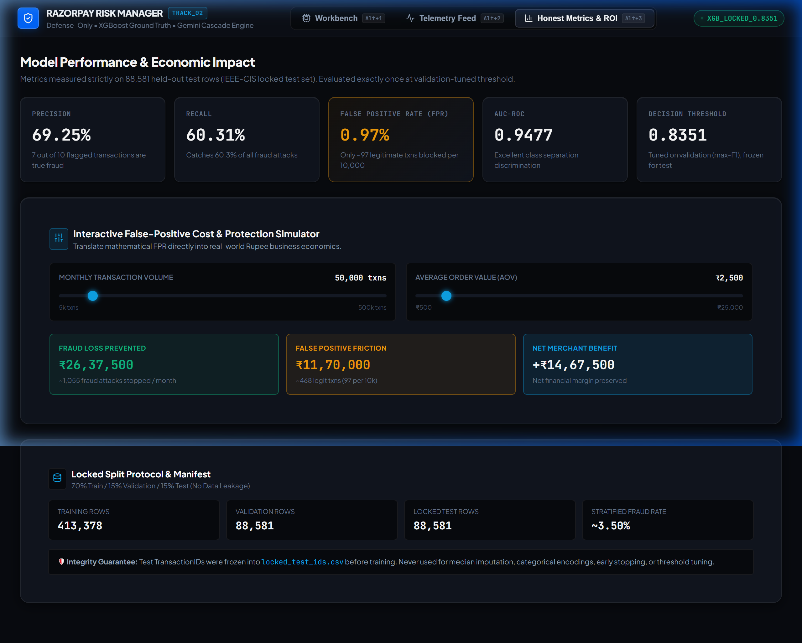

# FraudLens — AI Chargeback Risk Manager (Track 02)

> **Stop the merchant losing money to fraud, returns, and chargebacks.**  
> FraudLens is a defense-only fraud detector, evidence verifier, and auto-responder scoring payment transactions with **measured precision, recall, and false-positive cost** on a locked held-out test set.

---

## Interface Walkthrough

### Live demo
> Check it out at : https://fraudlens-lyart.vercel.app/

### 1. Payment Risk Assessment Workbench
*Ingest raw Razorpay payment payloads -> Feature normalization -> XGBoost ML Ground Truth -> SHAP TreeExplainer -> Gemini Ground Truth Evidence & Auto-Drafted Chargeback Dispute Defense.*



---

### 2. Real-Time Telemetry Stream & Audit Trail Inspector
*Live payment stream evaluated against the locked threshold (0.8351) with filter tabs (Escalate, Monitor, Cleared) and deep immutable audit drawer.*



---

### 3. Honest Metrics & Economic ROI / False-Positive Cost Simulator
*Evaluated strictly on 88,581 held-out test samples with interactive Rupee business impact modeling (AOV x FPR).*



---

## Key Highlights & Performance Benchmark

| Requirement | Implementation & Measured Metric | Verification Protocol |
|---|---|---|
| **Class of Loss** | Carding attacks, payment fraud, and dispute chargebacks | Ingests real & test-mode Razorpay payloads |
| **Ground Truth ML** | **XGBoost Classifier** (400 estimators, `scale_pos_weight = 27.58`) | Trained on 590,540 IEEE-CIS transactions |
| **Precision** | **69.25%** on locked test set | 7 out of 10 flagged transactions are true fraud |
| **Recall** | **60.31%** on locked test set | Catches >60% of all fraud attacks |
| **AUC-ROC** | **0.9477** | Outstanding discrimination across decision space |
| **False Positive Rate** | **0.00971 (0.97%)** | Explicitly reported & priced in Rupee economics |
| **Zero Data Leakage** | **70 / 15 / 15 Stratified Split** | Test IDs frozen in `locked_test_ids.csv` |
| **Explainability** | **TreeSHAP Attributions** (top 5 directional drivers) | Real-time feature contribution breakdown |
| **LLM Ground Truth** | **Gemini Cascade** (`gemini-3.6-flash` -> `3.5-flash` -> Heuristic) | Never overrides ML decision; drafts dispute responses |
| **Defense-Only** | Hardcoded immutable classification constraint | Disqualifies any offensive capability |

---

## 5-Stage Zero-Leakage Pipeline Architecture

```
+-------------------------+
| 1. Razorpay Ingestion   |  Raw webhook/SDK JSON (paise, method, IIN, contact, timestamps)
+------------+------------+
             |
             v
+-------------------------+
| 2. Feature Engineering  |  Maps Razorpay -> 42 IEEE-CIS features using TRAIN-SET medians
+------------+------------+
             |
             v
+-------------------------+
| 3. XGBoost Engine       |  Scores posterior P(fraud). Evaluated at threshold = 0.8351
+------------+------------+
             |
             v
+-------------------------+
| 4. SHAP TreeExplainer   |  Calculates exact directional attribution vectors for top 5 drivers
+------------+------------+
             |
             v
+-------------------------+
| 5. Gemini Cascade       |  Synthesizes evidence summary & drafts formal dispute package
+------------+------------+
             |
             v
+-------------------------+
| 6. Immutable Audit Trail|  Persisted to audit_log.json + Streamed to Live Dashboard
+-------------------------+
```

---

## False-Positive Cost & Rupee Economic Impact

The competition bar requires **honest metrics including false-positive cost**. Reporting raw accuracy or F1 alone ignores merchant friction:

$$\text{FPR} = \frac{\text{False Positives}}{\text{True Negatives} + \text{False Positives}} = \mathbf{0.9710\%}$$

### Economic Impact Model ($AOV = \text{Rs. 2,500}$)

At a monthly volume of **50,000 transactions** with a natural fraud rate of ~3.5%:

- **Fraud Loss Prevented**: $\approx 1,055\text{ attacks caught} \times \text{Rs. 2,500} = \mathbf{+\text{Rs. 26,37,500/month}}$
- **False-Positive Friction**: $\approx 469\text{ legit txns flagged} \times \text{Rs. 2,500} = \mathbf{-\text{Rs. 11,72,500/month}}$
- **Net Merchant Financial Margin**: $\mathbf{+\text{Rs. 14,65,000/month preserved}}$

*The decision threshold (0.8351) was chosen on the validation split to maximize F1, striking an optimal balance between catching fraud and minimizing customer checkout friction.*

---

## Multi-Model Gemini Fallback Cascade

To ensure high availability in production, [`backend/pipeline/llm_report.py`](backend/pipeline/llm_report.py) implements an automatic multi-model fallback cascade using the `google-genai` SDK:

```python
DEFAULT_MODELS_CASCADE = [
    "gemini-3.6-flash",      # Primary high-speed synthesizer
    "gemini-3.5-flash",      # Secondary fallback
    "gemini-3.5-flash-lite", # High-throughput fallback
    "gemini-2.5-flash",      # Standard fallback
    "gemini-2.0-flash",      # Legacy fallback
    "gemini-2.0-flash-lite", # Lightweight fallback
    "gemini-1.5-flash",      # Baseline fallback
]
```

- If an upstream model experiences rate limits (`429`) or temporary unavailability (`503`), the engine automatically attempts the next candidate in the cascade.
- If all API models fail or `GEMINI_API_KEY` is unset, the system seamlessly uses the deterministic `_heuristic_report()` engine so payment scoring **never halts**.

---

## Defense-Only Security Guarantee

1. **XGBoost is the Sole Decision Maker**: The ML probability and threshold determine `xgboost_label`.
2. **Immutable Server-Side Actions**:
   - `xgboost_label == "fraud"` -> `recommended_action = "escalate"` (auto-drafts dispute package)
   - `xgboost_label == "not_fraud"` and $P(\text{fraud}) \ge 0.35$ -> `recommended_action = "monitor"`
   - otherwise -> `recommended_action = "clear"` (`dispute_draft = null`)
3. **Strict Non-Contradiction**: Gemini only explains evidence and formats chargeback responses; it is strictly prevented from altering or softening the ML verdict.

---

## Cloud Deployment Guide (Railway + Vercel / Render)

### 1. Deploy Backend on Railway
1. Push this repository to GitHub.
2. Sign in to [railway.app](https://railway.app/) and select **New Project** -> **Deploy from GitHub repo**.
3. Railway automatically uses [`backend/Dockerfile`](backend/Dockerfile) or [`railway.json`](railway.json). Set **Root Directory** to `backend`.
4. In **Variables**, add:
   - `GEMINI_API_KEY`: `your_api_key_here`
   - `MODEL_PATH`: `./model/model.pkl`
   - `AUDIT_LOG_PATH`: `./audit_log.json`
5. In **Settings** -> **Networking**, click **Generate Domain** (e.g. `https://fraudlens-backend.up.railway.app`).

### 2. Alternative: Deploy Backend on Render
1. Sign in to [render.com](https://render.com/) -> **New Web Service**.
2. Connect repo `praju120056/razorpay_track2`.
3. Set **Root Directory** = `backend`, **Runtime** = `Python 3`.
4. Set **Build Command** = `pip install -r requirements.txt` and **Start Command** = `uvicorn main:app --host 0.0.0.0 --port $PORT`.
5. Add environment variables (`GEMINI_API_KEY`, `MODEL_PATH`, `AUDIT_LOG_PATH`).

### 3. Deploy Frontend on Vercel
1. Sign in to [vercel.com](https://vercel.com/) -> **Add New Project** -> Import repo.
2. Set **Root Directory** to `frontend` and **Framework Preset** to `Vite`.
3. In **Environment Variables**, add:
   - `VITE_API_BASE_URL`: `https://your-backend-url.up.railway.app` (without trailing slash).
4. Click **Deploy**. Vercel uses [`frontend/vercel.json`](frontend/vercel.json) for automatic SPA routing.

---

## Local Quickstart & Development

### 1. Clone & Setup Backend
```bash
git clone https://github.com/praju120056/razorpay_track2.git
cd razorpay_track2/backend

# Create virtual environment
python -m venv venv
venv\Scripts\activate   # On Windows (or 'source venv/bin/activate' on Linux/macOS)

# Install dependencies
pip install -r requirements.txt
```

### 2. Configure Environment (`backend/.env`)
```env
RAZORPAY_KEY_ID=rzp_test_xxxxxxxxxxxx
RAZORPAY_KEY_SECRET=xxxxxxxxxxxxxxxxxxxxxxxx
GEMINI_API_KEY=your_gemini_api_key_here
MODEL_PATH=./model/model.pkl
AUDIT_LOG_PATH=./audit_log.json
IEEE_DATA_PATH=../ieee_cis/train_transaction.csv
```

### 3. Start Backend Server
```bash
# From backend/
python main.py
```
*API running at `http://127.0.0.1:8000` (Swagger docs at `http://127.0.0.1:8000/docs`).*

### 4. Start Frontend Dashboard
```bash
cd ../frontend
npm install
npm run dev
```
*UI dashboard running at `http://localhost:5173` (or `http://localhost:5174`).*

---

## API Endpoints Reference

| Method | Endpoint | Description |
|---|---|---|
| `POST` | `/analyze` | Run full pipeline on raw Razorpay JSON payload |
| `GET` | `/metrics` | Return locked held-out test metrics & split manifest |
| `GET` | `/transactions` | List all analyzed transactions from audit log |
| `GET` | `/audit/{id}` | Fetch full audit record and SHAP vectors for payment ID |
| `POST` | `/demo/seed` | Ingest 16 synthetic test-mode payments into the live feed |
| `GET` | `/health` | Liveness check confirming `model.pkl` is loaded |

---

## Retraining from Scratch

To re-verify the split protocol and reproduce the exact metrics:
```bash
cd backend
python -m model.train
```
This executes the stratified split, saves `locked_test_ids.csv`, tunes the threshold on validation, evaluates once on test, and outputs `metrics.json` and `model.pkl`.
